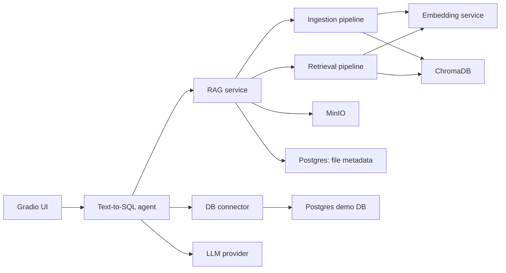

# Дипломный проект

Репозиторий содержит две связанные части магистерской ВКР:

1. **Дипломная работа** - LaTeX-исходники текста, шаблон оформления, библиография и материалы для иллюстраций.
2. **Программная реализация** - микросервисная система интеллектуального анализа реляционной БД через естественный язык: UI, Text-to-SQL агент, RAG-контур, сервис эмбеддингов, коннектор к БД, хранилища и метрики.

Тема работы: **Разработка интеллектуального модуля интерактивного анализа данных в реляционных базах данных**.

## Дипломная работа

LaTeX-часть находится в [`tex/document`](./tex/document). Точка входа документа - [`tex/document/src/main.tex`](./tex/document/src/main.tex). В ней задаются метаданные ВКР, подключаются глоссарий, термины, библиография и основные главы.

Ключевые файлы и директории:

| Путь | Назначение |
| --- | --- |
| [`tex/document/src/main.tex`](./tex/document/src/main.tex) | Главный LaTeX-файл диплома. Здесь подключаются все разделы и задаются данные титульной части. |
| [`tex/document/src/literature.bib`](./tex/document/src/literature.bib) | BibLaTeX-библиография. |
| [`tex/document/src/build.sh`](./tex/document/src/build.sh) | Скрипт сборки LaTeX-документа. |
| [`tex/document/diploma/diploma.cls`](./tex/document/diploma/diploma.cls) | Основной класс документа для оформления диплома. |
| [`tex/document/diploma/styles`](./tex/document/diploma/styles) | Набор стилевых файлов: титульный лист, таблицы, рисунки, листинги, библиография, приложения и другие элементы оформления. |
| [`tex/document/diploma/inc/mai.pdf`](./tex/document/diploma/inc/mai.pdf) | Вспомогательный PDF-ресурс шаблона. |
| [`tex/document/src/contents/abstract.tex`](./tex/document/src/contents/abstract.tex) | Реферат. |
| [`tex/document/src/contents/glossary.tex`](./tex/document/src/contents/glossary.tex) | Перечень сокращений и обозначений. |
| [`tex/document/src/contents/terms.tex`](./tex/document/src/contents/terms.tex) | Термины и определения. |
| [`tex/document/src/contents/chapter0_introduction`](./tex/document/src/contents/chapter0_introduction) | Введение: актуальность, цель, задачи, научная новизна и дополнительные вводные материалы. |
| [`tex/document/src/contents/chapter1_pain`](./tex/document/src/contents/chapter1_pain) | Постановка проблемы, цели и задачи, анализ подходов и существующих решений. |
| [`tex/document/src/contents/chapter2_theoretical_justification_solution`](./tex/document/src/contents/chapter2_theoretical_justification_solution) | Теоретическое обоснование решения: архитектура, стек, алгоритмы и логическая модель. |
| [`tex/document/src/contents/chapter3_implement_solution`](./tex/document/src/contents/chapter3_implement_solution) | Описание программной реализации: БД, модели, кодовые фрагменты и устройство решения. |
| [`tex/document/src/contents/chapter4_for_who/results.tex`](./tex/document/src/contents/chapter4_for_who/results.tex) | Описание результатов и сценариев применения технологии. |
| [`tex/document/src/contents/conclusion.tex`](./tex/document/src/contents/conclusion.tex) | Заключение. |
| [`tex/document/src/contents/materials`](./tex/document/src/contents/materials) | Изображения, схемы и материалы, используемые в тексте диплома. |

Сборка документа выполняется из директории [`tex/document/src`](./tex/document/src):

```bash
cd tex/document/src
./build.sh
```

## Программная реализация

Практическая часть - это прототип интеллектуального модуля, который принимает вопрос пользователя на естественном языке, получает релевантный контекст через RAG, генерирует SQL, безопасно выполняет его на демонстрационной реляционной БД и возвращает пользователю ответ.

Высокоуровневый поток:



Основной сценарий работы:

1. Пользователь задает вопрос в [`ui`](./ui) или напрямую вызывает API агента.
2. [`agent`](./agent) переписывает вопрос под поиск, вызывает RAG-контур, генерирует SQL и при необходимости итеративно исправляет запрос.
3. [`rag_service`](./rag_service) принимает документы, хранит информацию о файлах и проксирует retrieval-запросы.
4. [`ingest_pipeline_service`](./ingest_pipeline_service) забирает файл из очереди, извлекает текст, режет его на чанки и кладет векторы в ChromaDB.
5. [`retrieval_pipeline_service`](./retrieval_pipeline_service) ищет релевантные фрагменты в векторном хранилище.
6. [`embedding_model_service`](./embedding_model_service) строит эмбеддинги документов и запросов.
7. [`db_connector_service`](./db_connector_service) отдает схему БД и выполняет только безопасные `SELECT`/`WITH` SQL-запросы.
8. [`main_db`](./main_db) поднимает демонстрационную PostgreSQL-базу для экспериментов.

### Сервисы

Все основные компоненты описаны в [`docker-compose.yaml`](./docker-compose.yaml).

| Сервис | Порт на хосте | Назначение | Ключевые файлы |
| --- | ---: | --- | --- |
| `ui` | `7860` | Gradio-интерфейс пользователя, хранит историю Q&A в отдельной БД. | [`ui/src/main.py`](./ui/src/main.py), [`ui/src/modules/interface.py`](./ui/src/modules/interface.py) |
| `agent_service` | `8008` | FastAPI-сервис Text-to-SQL агента. Основной endpoint: `POST /giga`. | [`agent/src/main.py`](./agent/src/main.py), [`agent/src/agent/llm_graph.py`](./agent/src/agent/llm_graph.py), [`agent/src/agent/nodes.py`](./agent/src/agent/nodes.py), [`agent/README.md`](./agent/README.md) |
| `db_connector_service` | `8899` | Коннектор к демонстрационной БД: выполнение SQL, выдача полной схемы, описаний таблиц и примеров строк. | [`db_connector_service/src/main.py`](./db_connector_service/src/main.py), [`db_connector_service/src/schema.py`](./db_connector_service/src/schema.py) |
| `embedding_model_service` | `8001` | Сервис эмбеддингов для документов и поисковых запросов. | [`embedding_model_service/src/main.py`](./embedding_model_service/src/main.py), [`embedding_model_service/src/model.py`](./embedding_model_service/src/model.py), [`embedding_model_service/README.md`](./embedding_model_service/README.md) |
| `rag_service` | `8005` | Фасад RAG-контура: загрузка файлов, запуск ingestion, retrieval-запросы, метаданные файлов. | [`rag_service/src/main.py`](./rag_service/src/main.py), [`rag_service/src/routers/files_router.py`](./rag_service/src/routers/files_router.py) |
| `ingest_pipeline_service` | `8002` | API постановки ingestion-задач в Redis/RQ. | [`ingest_pipeline_service/src/main.py`](./ingest_pipeline_service/src/main.py), [`ingest_pipeline_service/src/services/worker/tasks.py`](./ingest_pipeline_service/src/services/worker/tasks.py) |
| `ingestion_worker` | - | RQ worker, который выполняет ingestion-задачи из очереди `ingestion`. | [`ingest_pipeline_service/src/run_worker.py`](./ingest_pipeline_service/src/run_worker.py) |
| `retrieval_pipeline_service` | `8004` | Векторный поиск по ChromaDB. Endpoint в коде: `POST /retieval`. | [`retrieval_pipeline_service/src/main.py`](./retrieval_pipeline_service/src/main.py), [`retrieval_pipeline_service/src/services.py`](./retrieval_pipeline_service/src/services.py) |
| `postgres_demo` | `5433` | Демонстрационная PostgreSQL-БД для выполнения SQL-запросов агента. | [`main_db/Dockerfile`](./main_db/Dockerfile), [`main_db/init_db.sh`](./main_db/init_db.sh), [`main_db/backup`](./main_db/backup) |
| `db_files_info` | `5435` | PostgreSQL-БД с метаданными загруженных файлов. | [`rag_service/src/models/file_model.py`](./rag_service/src/models/file_model.py), [`rag_service/src/repositories/file_info_repository.py`](./rag_service/src/repositories/file_info_repository.py) |
| `db_for_ui` | `5432` | PostgreSQL-БД интерфейса для истории вопросов и ответов. | [`ui/src/modules/models.py`](./ui/src/modules/models.py), [`ui/src/modules/database.py`](./ui/src/modules/database.py) |
| `chromadb` | `8000` | Векторное хранилище RAG-контекста. | [`docker-compose.yaml`](./docker-compose.yaml) |
| `minio` | `9000`, `9001` | S3-совместимое объектное хранилище исходных файлов. | [`ingest_pipeline_service/src/repositories/minio_repository.py`](./ingest_pipeline_service/src/repositories/minio_repository.py), [`rag_service/src/repositories/minio_repository.py`](./rag_service/src/repositories/minio_repository.py) |
| `redis_queue` | `6379` | Очередь фоновой обработки файлов. | [`ingest_pipeline_service/src/services/queue_service.py`](./ingest_pipeline_service/src/services/queue_service.py) |

### Структура программной части

| Путь | Что внутри |
| --- | --- |
| [`agent`](./agent) | LangGraph/FastAPI агент. Содержит граф генерации SQL, узлы самокоррекции, промпты, LLM-провайдеры, утилиты вызова RAG и DB connector. |
| [`db_connector_service`](./db_connector_service) | FastAPI-обертка над реляционной БД. Ограничивает выполнение опасных SQL-операций, добавляет лимиты и предоставляет schema endpoints. |
| [`embedding_model_service`](./embedding_model_service) | Отдельный сервис модели эмбеддингов. В Compose используется `intfloat/multilingual-e5-base`, кэш HuggingFace прокидывается в `.hf_cache`. |
| [`rag_service`](./rag_service) | API для загрузки документов, получения информации о файлах и обращения к retrieval pipeline. |
| [`ingest_pipeline_service`](./ingest_pipeline_service) | Ingestion API и worker: Redis/RQ, загрузка из MinIO, парсинг документов, чанкинг, запись в ChromaDB. |
| [`retrieval_pipeline_service`](./retrieval_pipeline_service) | Поиск похожих чанков в ChromaDB по эмбеддингу запроса. |
| [`ui`](./ui) | Gradio-интерфейс, авторизация, история чатов и интеграция с backend API. |
| [`main_db`](./main_db) | Демонстрационная PostgreSQL-БД с дампами и скриптами инициализации. |
| [`metrics`](./metrics) | Скрипты и результаты оценки Text-to-SQL качества: exact matching, execution accuracy и варианты SQL-ответов разных моделей. |
| [`examples/rag_examples`](./examples/rag_examples) | Примеры документов для загрузки в RAG-контур. |
| [`pipeline.py`](./pipeline.py) | Вспомогательный скрипт для анализа текстовых файлов диплома: подсчет символов и поиск артефактов в тексте. |
| [`example.rag.json`](./example.rag.json) | Пример JSON-данных для RAG/экспериментов. |
| [`logger_template.py`](./logger_template.py) | Шаблон логгера, используемый как база для сервисных логгеров. |
| [`clean.sh`](./clean.sh) | Вспомогательный скрипт очистки локальных артефактов. |

### Агент

Подробное описание агента есть в [`agent/README.md`](./agent/README.md). Основные файлы:

| Путь | Назначение |
| --- | --- |
| [`agent/src/main.py`](./agent/src/main.py) | Создание FastAPI-приложения и подключение роутеров. |
| [`agent/src/api/routers/giga_router.py`](./agent/src/api/routers/giga_router.py) | Endpoint `POST /giga`, принимающий вопрос пользователя. |
| [`agent/src/agent/run_agent.py`](./agent/src/agent/run_agent.py) | Запуск графа агента. |
| [`agent/src/agent/llm_graph.py`](./agent/src/agent/llm_graph.py) | Сборка LangGraph-графа. |
| [`agent/src/agent/nodes.py`](./agent/src/agent/nodes.py) | Узлы графа: RAG-запрос, генерация SQL, выполнение, критика, улучшение и финальный ответ. |
| [`agent/src/agent/prompts.py`](./agent/src/agent/prompts.py) | Промпты агента. |
| [`agent/src/agent/llm_provider.py`](./agent/src/agent/llm_provider.py) | Абстракция LLM-провайдеров. |
| [`agent/src/functions/rag_search.py`](./agent/src/functions/rag_search.py) | Tool для обращения к RAG. |
| [`agent/src/utils/external_api.py`](./agent/src/utils/external_api.py) | Общая утилита HTTP-вызовов внешних сервисов. |
| [`agent/src/utils/sql.py`](./agent/src/utils/sql.py) | Извлечение SQL из ответа модели. |

Агент использует итеративный цикл: переформулирование вопроса для RAG, retrieval, генерация SQL, выполнение SQL, критика результата, при необходимости получение полной схемы БД и улучшение запроса. Лимит попыток и логика переходов описаны в [`agent/README.md`](./agent/README.md).

### RAG-контур

RAG-контур разделен на несколько сервисов, чтобы загрузка документов, построение эмбеддингов и retrieval не были смешаны в одном процессе.

| Компонент | Роль |
| --- | --- |
| [`rag_service/src/routers/files_router.py`](./rag_service/src/routers/files_router.py) | `POST /upload_and_run` сохраняет файл и запускает ingestion; `POST /ask_retrieval` проксирует запрос в retrieval pipeline; `POST /get_file_info` возвращает метаданные файла. |
| [`ingest_pipeline_service/src/main.py`](./ingest_pipeline_service/src/main.py) | `POST /ingest/{file_id}` ставит задачу обработки файла в очередь; `GET /status/{job_id}` возвращает статус задачи. |
| [`ingest_pipeline_service/src/services/worker/tasks.py`](./ingest_pipeline_service/src/services/worker/tasks.py) | Основная логика фоновой обработки файла. |
| [`retrieval_pipeline_service/src/main.py`](./retrieval_pipeline_service/src/main.py) | `POST /retieval` выполняет поиск релевантных чанков. |
| [`embedding_model_service/src/main.py`](./embedding_model_service/src/main.py) | `POST /embed/documents` и `POST /embed/query` возвращают эмбеддинги. |

### База данных и SQL connector

[`db_connector_service`](./db_connector_service) нужен, чтобы изолировать агента от прямого доступа к БД. Он предоставляет:

| Endpoint | Назначение |
| --- | --- |
| `POST /query` | Выполнить SQL-запрос. Разрешены только `SELECT` и `WITH`; опасные ключевые слова блокируются; если нет `LIMIT`, добавляется лимит по умолчанию. |
| `GET /schema` | Получить полную схему БД. |
| `GET /schema/tables` | Получить граф/список таблиц в текстовом виде. |
| `GET /schema/table/{table_name}` | Получить описание конкретной таблицы. |
| `GET /schema/table/{table_name}/sample` | Получить первые строки таблицы в RAG-friendly формате. |

Демонстрационная БД поднимается сервисом [`main_db`](./main_db) и доступна внутри Compose как `postgres_demo:5432`, на хосте - `localhost:5433`.

### Метрики и эксперименты

Директория [`metrics`](./metrics) содержит код и данные для оценки качества Text-to-SQL:

| Путь | Назначение |
| --- | --- |
| [`metrics/exact_matching_accuracy.py`](./metrics/exact_matching_accuracy.py) | Расчет exact matching accuracy. |
| [`metrics/exact_set_match.py`](./metrics/exact_set_match.py) | Проверка совпадения множеств. |
| [`metrics/execution_accuracy_run.py`](./metrics/execution_accuracy_run.py) | Запуск execution accuracy. |
| [`metrics/execution_accuracy_intellect.py`](./metrics/execution_accuracy_intellect.py) | Дополнительный сценарий оценки execution accuracy. |
| [`metrics/compact_all.py`](./metrics/compact_all.py) | Агрегация/компактизация результатов. |
| [`metrics/sqls`](./metrics/sqls) | SQL-ответы baseline и моделей `giga`, `glm`, `qwen`. |
| [`metrics/results`](./metrics/results) | CSV-результаты расчетов метрик. |
| [`metrics/all_out.md`](./metrics/all_out.md) | Сводный вывод экспериментов. |

## Быстрый старт

Требования:

- Docker и Docker Compose.
- Доступ к LLM-провайдеру, который настроен в конфигурации агента.
- Достаточно места для локальных volume-директорий: `.hf_cache`, `.chroma_data`, `.postgres_data`, `.minio_data`, `.files_info_data`, `.ui_data`, `.redis_queue`.

Запуск всей системы:

```bash
docker compose up --build
```

После запуска основные точки входа:

| URL | Что открыть |
| --- | --- |
| [`http://localhost:7860`](http://localhost:7860) | Gradio UI. |
| [`http://localhost:8008/docs`](http://localhost:8008/docs) | Swagger агента. |
| [`http://localhost:8005/docs`](http://localhost:8005/docs) | Swagger RAG service. |
| [`http://localhost:8002/docs`](http://localhost:8002/docs) | Swagger ingestion API. |
| [`http://localhost:8004/docs`](http://localhost:8004/docs) | Swagger retrieval service. |
| [`http://localhost:8001/docs`](http://localhost:8001/docs) | Swagger embedding service. |
| [`http://localhost:8899/docs`](http://localhost:8899/docs) | Swagger DB connector. |
| [`http://localhost:9001`](http://localhost:9001) | MinIO console. |

Пример прямого вызова агента:

```bash
curl -X POST http://localhost:8008/giga \
  -H "Content-Type: application/json" \
  -d '{"question":"Какие рейсы были выполнены чаще всего?"}'
```

## Как быстро вкатиться в проект

1. Начать с [`docker-compose.yaml`](./docker-compose.yaml), чтобы понять runtime-состав системы и связи между сервисами.
2. Посмотреть [`agent/README.md`](./agent/README.md), [`agent/src/agent/llm_graph.py`](./agent/src/agent/llm_graph.py) и [`agent/src/agent/nodes.py`](./agent/src/agent/nodes.py) - это ядро Text-to-SQL логики.
3. Посмотреть [`rag_service/src/routers/files_router.py`](./rag_service/src/routers/files_router.py), [`ingest_pipeline_service/src/services/worker/tasks.py`](./ingest_pipeline_service/src/services/worker/tasks.py) и [`retrieval_pipeline_service/src/services.py`](./retrieval_pipeline_service/src/services.py), чтобы понять RAG-пайплайн.
4. Посмотреть [`db_connector_service/src/main.py`](./db_connector_service/src/main.py) и [`db_connector_service/src/schema.py`](./db_connector_service/src/schema.py), чтобы понять, как агент получает схему и выполняет SQL.
5. Для связи реализации с текстом ВКР открыть [`tex/document/src/contents/chapter3_implement_solution`](./tex/document/src/contents/chapter3_implement_solution) и [`tex/document/src/contents/chapter2_theoretical_justification_solution`](./tex/document/src/contents/chapter2_theoretical_justification_solution).