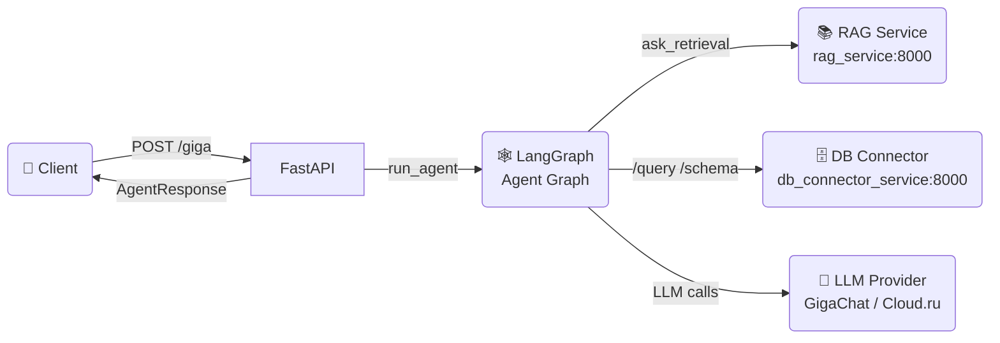
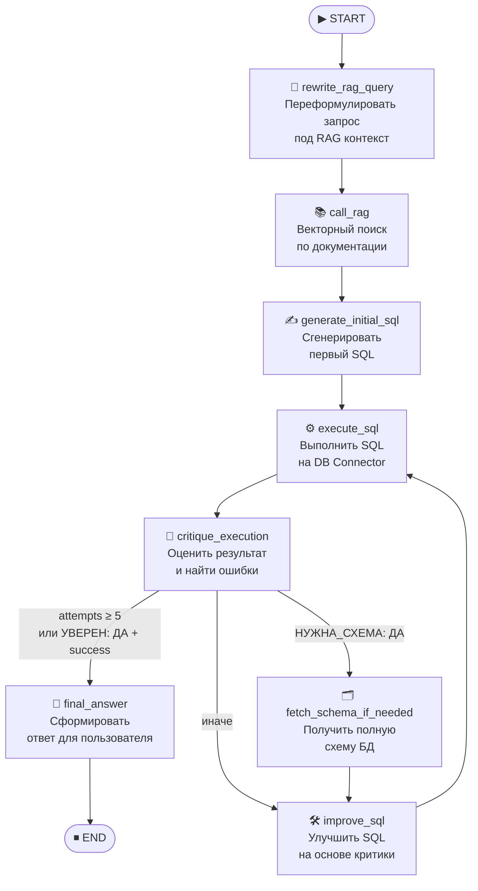

# 🤖 AI TextToSQL Agent


Бэкенд-сервис на **FastAPI**, реализующий интеллектуального **Text-to-SQL агента** на основе графа ИИ-агентов (LangGraph). Агент принимает вопрос на естественном языке, автоматически находит релевантный контекст через RAG-систему, генерирует и итеративно исправляет SQL-запрос, выполняет его на удалённом сервисе и возвращает бизнес-ответ пользователю.

---

## 🚀 Основные возможности

- **Natural Language → SQL**: автоматический перевод вопроса в SQL через LLM
- **RAG-система**: векторный поиск по технической документации и схемам БД для контекстуализации запроса
- **Итеративная самокоррекция**: граф агентов с критиком, который проверяет и улучшает запрос до 5 раз
- **Динамическое получение схемы БД**: если агент не уверен в структуре — запрашивает актуальную схему
- **Мульти-провайдерный LLM**: поддержка GigaChat (Sber) и Cloud.ru (Qwen, GLM) через единый интерфейс
- **Полное логирование**: все этапы работы агента логируются в файл и консоль с ротацией
- **Docker-ready**: готовый `Dockerfile` для деплоя в контейнере

---

## 🏗 Архитектура проекта

### Общая схема взаимодействия



### Диаграмма модулей

```mermaid
graph TD
    main["main.py\n(FastAPI app)"]
    main --> api

    subgraph api["api/"]
        routers["routers/\ngiga_router\nbase_router"]
        schemas["schemas/\nAgentRequest\nAgentResponse"]
    end

    routers --> agent

    subgraph agent["agent/"]
        run["run_agent.py"]
        graph["llm_graph.py\n(StateGraph)"]
        nodes["nodes.py\n(8 узлов)"]
        prompts["prompts.py"]
        llm_prov["llm_provider.py"]
        states["states.py\n(State TypedDict)"]
        errors["errors.py"]
    end

    subgraph functions["functions/"]
        rag_search["rag_search.py\n(@tool)"]
        web_search["web_search.py\n(@tool)"]
    end

    subgraph utils["utils/"]
        ext_api["external_api.py\ncall_api()"]
        sql_util["sql.py\nextract_sql()"]
    end

    nodes --> functions
    nodes --> utils
    llm_prov --> settings
    rag_search --> utils

    settings["settings.py\nSettings / agent_settings"]
    logger["logger.py\nLogger"]
```

### Структура директорий

| Путь | Назначение |
|---|---|
| `src/main.py` | Точка входа FastAPI приложения |
| `src/api/routers/` | HTTP-роутеры (`/`, `/giga`) |
| `src/api/schemas/` | Pydantic-схемы запросов и ответов |
| `src/agent/` | Ядро системы: граф агентов, узлы, промпты, LLM-провайдер |
| `src/functions/` | LangChain tools (RAG-поиск, веб-поиск) |
| `src/utils/` | Утилиты: HTTP-клиент, парсинг SQL |
| `src/settings.py` | Централизованная конфигурация через pydantic-settings |
| `src/logger.py` | Настраиваемый логгер с ротацией файлов |

---

## 🕸 Схема Графа ИИ-агентов

### Визуализация графа



### Узлы (Nodes)

| Узел | Описание |
|---|---|
| `rewrite_rag_query` | Переформулирует вопрос пользователя в поисковый запрос, оптимизированный для векторной БД (термины схем, DDL, SQL-паттерны) |
| `call_rag` | Вызывает RAG-инструмент, получает релевантные фрагменты документации и DDL-схем |
| `generate_initial_sql` | На основе вопроса и RAG-контекста генерирует первую версию SQL |
| `execute_sql` | Отправляет SQL в `db_connector_service`, получает результат или ошибку |
| `critique_execution` | LLM-критик анализирует SQL и результат: находит синтаксические/логические ошибки, оценивает соответствие вопросу |
| `fetch_schema_if_needed` | Если критик определил `НУЖНА_СХЕМА: ДА` — запрашивает полную DDL-схему БД |
| `improve_sql` | Переписывает SQL с учётом замечаний критика и (опционально) полной схемы |
| `final_answer` | Интерпретирует данные из БД и формулирует финальный Markdown-ответ для пользователя |

### Переходы (Edges) — логика `decide_after_execution`

```python
# Условная логика после узла critique_execution:
if attempts >= 5          → "final"        # жёсткий лимит попыток
if "УВЕРЕН: ДА" in critique
   and sql_result.success → "final"        # критик доволен — завершаем
if needs_schema           → "fetch_schema" # нужна схема — идём за ней
else                      → "improve"      # иначе — улучшаем SQL
```

### Состояние (State)

```python
class State(TypedDict):
    messages: List[HumanMessage | AIMessage]  # история + вопрос пользователя в [0]
    rag_query: str        # переформулированный запрос для RAG
    rag_context: str      # найденные фрагменты документации
    sql_query: str        # текущая версия SQL
    sql_result: Dict      # результат выполнения: success, rows, data, error, csv_text
    critique: str         # текст критики от LLM-критика
    attempts: int         # счётчик попыток (лимит: 5)
    needs_schema: bool    # флаг запроса схемы БД
    extra_schema: str     # полученная DDL-схема БД
    sqls: list[str]       # история всех версий SQL
```

---

## 🛠 Установка и Запуск

### Требования

- Python **3.13+**
- Docker (для запуска в контейнере)
- Доступ к сервисам `rag_service` и `db_connector_service`

### Локальный запуск

```bash
# 1. Клонировать репозиторий
git clone <repo-url>
cd agent

# 2. Создать виртуальное окружение
python -m venv .venv
source .venv/bin/activate  # Linux/macOS
# или
.venv\Scripts\activate     # Windows

# 3. Установить зависимости
pip install -r requirements.txt

# 4. Настроить переменные окружения
cp src/.env.example src/.env
# Отредактировать src/.env (см. раздел ниже)

# 5. Запустить сервис
cd src
uvicorn main:app --host 0.0.0.0 --port 8000 --reload
```

### Настройка `.env`

```properties
# ── LLM Провайдеры ──────────────────────────────────────────────────
# [ОБЯЗАТЕЛЬНО] API-ключ GigaChat (Сбер)
AGENT_SBER_API_KEY=your_sber_api_key_here

# [ОБЯЗАТЕЛЬНО если используется Cloud.ru] API-ключ Cloud.ru
AGENT_CLOUD_API_KEY=your_cloud_ru_api_key_here

# [ОБЯЗАТЕЛЬНО если используется Cloud.ru] URL Cloud.ru Foundation Models
AGENT_CLOUDRU_API_URL=https://foundation-models.api.cloud.ru/v1

# [ОБЯЗАТЕЛЬНО] Имя модели для агента
# Варианты: giga-lite | giga-pro | qwen-coder | glm
AGENT_CONTAINER_LLM=giga-lite

# ── Приложение ───────────────────────────────────────────────────────
# Режим отладки FastAPI (true/false)
AGENT_DEBUG=false

# ── Внешние сервисы ──────────────────────────────────────────────────
# [ОБЯЗАТЕЛЬНО] URL RAG-сервиса (векторный поиск)
AGENT_RAG_SERVICE_URL=http://rag_service:8000

# [ОБЯЗАТЕЛЬНО] URL сервиса-коннектора к БД
AGENT_DB_CONNECTOR_URL=http://db_connector_service:8000
```

---

## 🌐 API Документация

Интерактивная документация доступна после запуска:
- **Swagger UI**: `http://localhost:8000/docs`
- **ReDoc**: `http://localhost:8000/redoc`

### Эндпоинты

| Метод | Путь | Описание | Auth |
|---|---|---|---|
| `GET` | `/` | Health-check, проверка работоспособности | — |
| `POST` | `/giga` | Задать вопрос AI Text-to-SQL агенту | — |

### Примеры запросов

**Health-check:**
```bash
curl -X GET http://localhost:8000/
# {"message": "Hello from FastAPI GigaChat Agent"}
```

**Запрос к агенту:**
```bash
curl -X POST http://localhost:8000/giga \
  -H "Content-Type: application/json" \
  -d '{"question": "Сколько бронирований было сделано за последний месяц?"}'
```

**Ответ:**
```json
{
  "answer": "За последний месяц было сделано **1 284 бронирования**.\n\n| Метрика | Значение |\n|---|---|\n| Всего бронирований | 1 284 |\n| Общая сумма | 5 432 100 руб. |"
}
```

**Python (requests):**
```python
import requests

response = requests.post(
    "http://localhost:8000/giga",
    json={"question": "Покажи топ-5 самых дорогих билетов"}
)
print(response.json()["answer"])
```

---

## 🐳 Docker

### Сборка и запуск

```bash
# Сборка образа
docker build -t ai-texttosql-agent .

# Запуск контейнера (с передачей .env)
docker run -d \
  --name agent \
  --env-file src/.env \
  -p 8000:8000 \
  ai-texttosql-agent
```

### Запуск в составе docker-compose

```yaml
# пример фрагмента docker-compose.yml
services:
  agent:
    build: ./agent
    ports:
      - "8000:8000"
    env_file:
      - ./agent/src/.env
    depends_on:
      - rag_service
      - db_connector_service
```

### Переменные окружения в Docker

Все переменные из раздела [Настройка `.env`](#настройка-env) могут быть переданы через `--env-file` или через `-e KEY=VALUE`.

> **Важно:** Внутри Docker-сети используй имена сервисов как хосты:
> `AGENT_RAG_SERVICE_URL=http://rag_service:8000`

---

## 📄 Лицензия

MIT License. See [LICENSE](LICENSE) for details.
